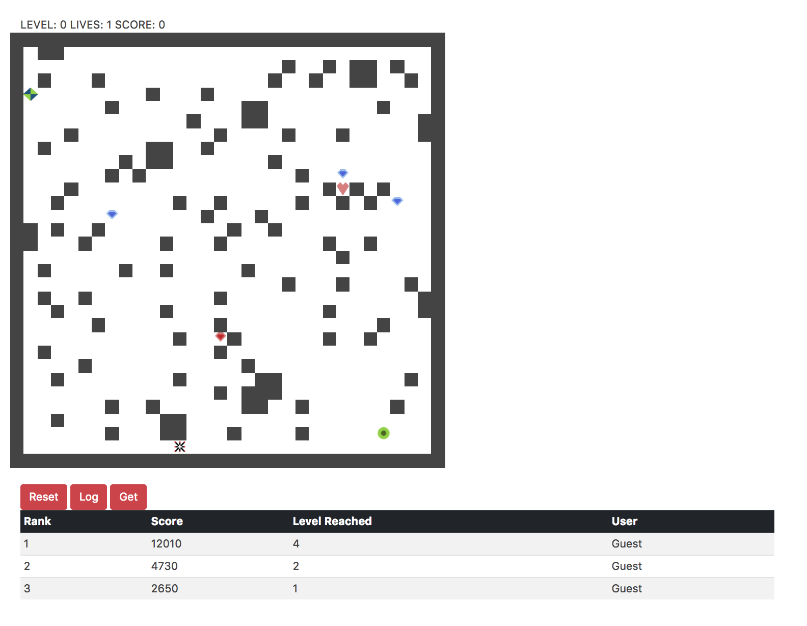

# PixelKnights

# Required Documentation
### Links
| Item | Link |
|:----:|:----:|
| Client Repository  | https://github.com/ckempema/PixelKnight  |
| Client Deployed   | https://ckempema.github.io/PixelKnight/  |
| Back End Repository   |  https://github.com/ckempema/PixelKnight-api |
| Back End Deployed   | https://afternoon-earth-99855.herokuapp.com |

### What is this?
  For my final project I made yet another game. This game uses a procedurally generated maze that the can player can solve, dodging enemies and grabbing points along the way. The points are loaded into a comparativly simple back end, and can be retrieved to show a sorted highscores list of the top 100 attempts.

### Technologies Used
  ##### Front End
    - HTML/SCSS
    - JavaScript
    - Node.js
    - JQuery

  ##### Back End
    - Express
    - MongoDB

  ##### Algorithms
    - Insertion Sort
    - Prims Algorithm (Modified)
    - Dijkstras Algorithm

### Unsolved Problems
  There are a number of things in the game that could be modified. The weights of the game could be modified endlessly to try and perfect the randomization and the gameplay mechanics. Artistically there is alot to improve, and further gameplay mechanics could be added.

  Here is a list of features to improve `(they're definitely not errors that fail requirements)`
  - Fire spawn block does not turn red
  - Performance improvements
  - Gamepiece location generations more random
  - More user testing
  - Improve code readability

  Because of the complexity of the application, there was never enough time or test subjects to really test every possible game board generation. There are a number of unmodeled interactions that could affect the game that I dont know about, so there very well might be more things to fix later on.

### Planning/Problem Solving
  I started with a very good plan `(see below)`, and then feature creep got in the way. Oftentimes implementing one thing would break everything else and then I would have to go element by element and fix each interaction. This resulted in some redundant code, and a somewhat unreadable codebase because not all handlers are located in the same place. I was able to get everything working, but with more time I can resolve this into a much cleaner looking codebase.

### Front End Documentation Requirements
#### Embedded Image

#### Use instructions
The crud interactions all happen behind the scenes on the front end. Once a player clicks new game they can play with the arrow keys, using space to stop. Once all their lives are expended their score will be logged to the api, and they can view it if it is in the top 100. Users can delete their own scores (if not playing as guest) if they so desire.

### Back End Documentation Requirements

#### User Routes
| Request Type | Path | Data | Function |
|:-:|:-:|:-:|:-:|
| POST | /sign-in  | data: credentials  | Sign In  |
| PATCH  | /change-password | passwords {old: '', new: ''}  | Change Password  |
| DELETE  | /sign-out  | Header: Authorization  | Sign Out  |

#### Score Routes
| Request Type | Path | Data | Function |
|:-:|:-:|:-:|:-:|
| POST  | /scores  | token, score | Submit Score |
| GET   | /scores  | token | Get all scores  |
| GET   | /scores/{:id} | token  | Get individual score |
| PATCH | /scores  | token, score  | update (not used in front end) |
| DELETE | /scores | token, id | Delete Entry |

#### Usage
The Back end is deployed to heroku, so calls can be made. It is just a data store, all logic for implenting sorting and top scores is implemented in the front end. This should be fixed later, but was not possible in the time avalible.

# Planning Documentation:
## Wireframe

## User Stories
  #### Authentication
    - Sign up
    - Sign in
    - Sign out
    - Change Password

  #### Back End
    - Store top 5-10 global highscores
    - Store top 5-10 user highscores

  #### Gameplay Ideas
    - Generate a dynamic map for each level using an adaptation of prims algorithm
    - Generate random start and stop points for all other game items
    - Once user has reached the level finish location advnace the level and regen on a new map
    - Create an enemy with a bad algorithm for hunting user
    - Add more enemies once the level gets high enough (>3?)
    - Track a score based on the number of gold pieces collected in conjunction with number of completed levels
    - Remove lives when player is caught by hunter, reset game when lives is < 0, Randomly allocate bonus lives on a ~1/20 probablility distribution

  #### Front End
    - Give user the option to view high scores
## Plan to MVP

  #### Stage 1: Implement basic Gameplay
    - Front end with user authentication
    - Back end that tracks user highscores
    - Dynamically generate a maze using prims algorithm
      + Ensure that maze will always have a solution
    - Allow user to move around the maze
    - Display a message when the maze has been solved

  #### Stage 2: Advanced Game Logic
    - Once maze is complete autogenerate a new maze
    - Create a fairly dumb hunter bot that tries to reach the User
    - Generate a score based on level reached before first death
    - Save score into backend

  #### Stage 3: Final cleanup for V1
    - Allow user to retrieve personal highscores
    - Display highscores
    - Ensure the game can be played
    - Clean up UI and test for bugs

  ### More Ideas once mvp is completed
    - Add in random `gold` pieces that boost the score
    - Add in lives to get the user further into the game
    - Add in multiple hunters as level progresses
    - Add in play/pause buttons once game has begun
    - Add in a timer element that affects score
    - Create a guest login

## Back End ERD

