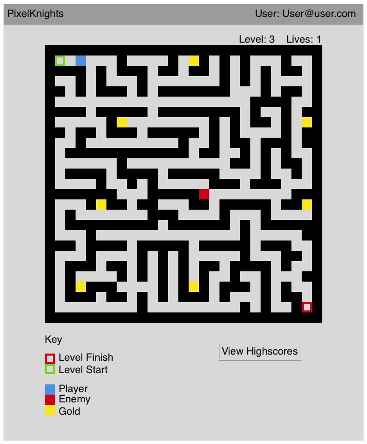
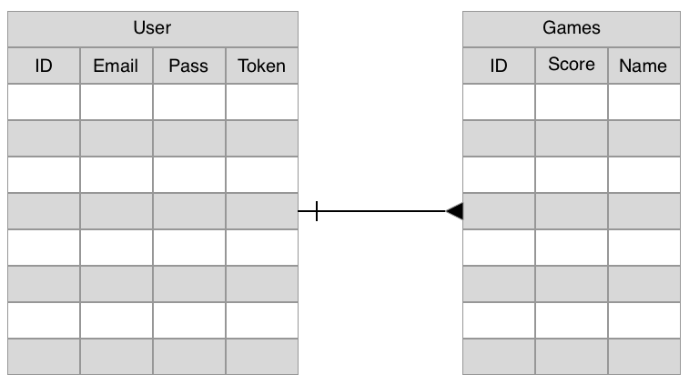

# PixelKnights

## Wireframe

## User Stories
  #### Authentication
    - Sign up
    - Sign in
    - Sign out
    - Change Password

  #### Back End
    - Store top 5-10 global highscores
    - Store top 5-10 user highscores

  #### Gameplay Ideas
    - Generate a dynamic map for each level using an adaptation of prims algorithm
    - Generate random start and stop points for all other game items
    - Once user has reached the level finish location advnace the level and regen on a new map
    - Create an enemy with a bad algorithm for hunting user
    - Add more enemies once the level gets high enough (>3?)
    - Track a score based on the number of gold pieces collected in conjunction with number of completed levels
    - Remove lives when player is caught by hunter, reset game when lives is < 0, Randomly allocate bonus lives on a ~1/20 probablility distribution

  #### Front End
    - Give user the option to view high scores
## Plan to MVP

  #### Stage 1: Implement basic Gameplay
    - Front end with user authentication
    - Back end that tracks user highscores
    - Dynamically generate a maze using prims algorithm
      + Ensure that maze will always have a solution
    - Allow user to move around the maze
    - Display a message when the maze has been solved

  #### Stage 2: Advanced Game Logic
    - Once maze is complete autogenerate a new maze
    - Create a fairly dumb hunter bot that tries to reach the User
    - Generate a score based on level reached before first death
    - Save score into backend

  #### Stage 3: Final cleanup for V1
    - Allow user to retrieve personal highscores
    - Display highscores
    - Ensure the game can be played
    - Clean up UI and test for bugs

  ### More Ideas once mvp is completed
    - Add in random `gold` pieces that boost the score
    - Add in lives to get the user further into the game
    - Add in multiple hunters as level progresses
    - Add in play/pause buttons once game has begun
    - Add in a timer element that affects score
    - Create a guest login

## Back End ERD

